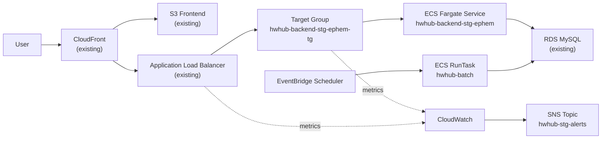
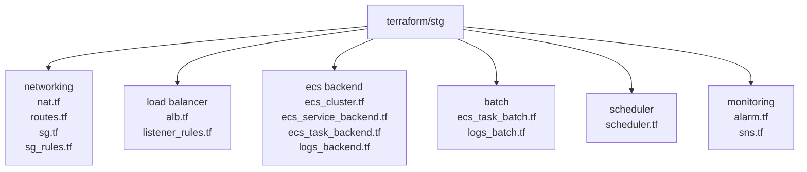

# Housework Hub Infrastructure (hw-hub-infra)

このリポジトリは **HwHub の AWS インフラを Terraform で管理するためのリポジトリ**です。

---

# 概要

現在の STG 環境は、**既存リソースを一部参照しつつ、ECS / Scheduler / 監視などを Terraform で管理する構成**です。  
当初想定していた `stg-core / stg-ephemeral` の分離は採用せず、**実運用に合わせて単一の STG Terraform ディレクトリで管理**しています。

---

# Architecture

## STG AWS Architecture



## Terraform Structure



---

# 管理対象

Terraform により管理している主なリソース

- NAT Gateway / EIP
- Route
- Security Group / Security Group Rule
- ephem Target Group
- ECS Cluster
- ECS Backend Task Definition
- ECS Backend Service
- ECS Batch Task Definition
- EventBridge Scheduler
- CloudWatch Log Group
- CloudWatch Alarm

---

# Terraform が管理していないもの

既存リソースとして参照しているもの

- 既存 ALB
- 既存 ACM Certificate
- 既存 RDS
- 既存 ECR Repository
- 既存 Secrets Manager
- 既存 SNS Topic
- 既存 S3（Frontend / file storage）
- 既存 CloudFront

これらは Terraform では **data source として参照する**、または **運用対象外の既存リソース**として扱います。

---

# ディレクトリ構成

例

```text
terraform/stg

provider.tf
variables.tf
terraform.tfvars
outputs.tf

nat.tf
routes.tf
sg.tf
sg_rules.tf

alb.tf
listener_rules.tf

ecs_cluster.tf
ecs_task_backend.tf
ecs_service_backend.tf
logs_backend.tf

ecs_task_batch.tf
logs_batch.tf
scheduler.tf

alarm.tf
sns.tf
```

---

# 運用方針

## Backend デプロイ

GitHub Actions により以下を実施します。

1. Docker image build
2. ECR push
3. ECS Service 更新

Terraform 側では `aws_ecs_service.backend` に `ignore_changes = [task_definition]` を設定し、  
**Backend の task definition revision 切替は GitHub Actions 側で行う**前提にしています。

## Batch デプロイ

Batch は `stg-latest` イメージを参照する構成です。

- GitHub Actions: ECR push
- EventBridge Scheduler: ECS RunTask 実行
- Terraform: Scheduler / TaskDefinition / Networking / Monitoring 管理

---

# Terraform 操作

```bash
terraform init
terraform plan
terraform apply
```

---

# 注意点

- Backend Service は既存 ALB 配下の ephem Target Group を利用
- Batch は EventBridge Scheduler から ECS RunTask で起動
- Terraform apply 中は一時的に alarm が発報する可能性あり
- old cluster / old target group は削除済み
- 既存 ALB / RDS / CloudFront / S3 は Terraform の直接管理対象外

---

# 今後の拡張候補

- module 化
- PRD 用ディレクトリ分離
- 監視項目追加（CPU / Memory / RDS / Scheduler failure）
- README / Runbook 充実
