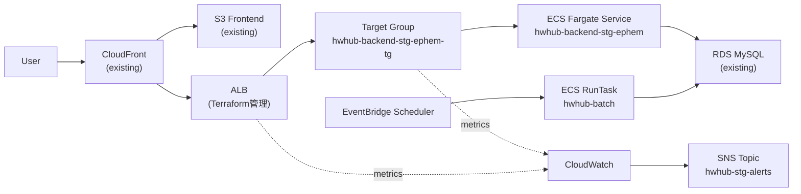

# Housework Hub Infrastructure (hw-hub-infra)

このリポジトリは **HwHub の AWS インフラを Terraform で管理するためのリポジトリ**です。

設計方針の詳細は [terraform_structure_policy.md](./terraform_structure_policy.md) を参照してください。

---

## 概要

STG 環境は **Ephemeral 構成**で管理しています。  
使用するときだけ `terraform apply` で起動し、使わないときは `terraform destroy` で削除することでコストを最小化します。

| 状態 | 日次コスト（概算） |
|------|----------------|
| apply（起動中） | ~$5.71/日（大半がNATゲートウェイ） |
| destroy（停止中） | ~$0.09/日（RDS ストレージのみ） |

---

## Architecture



---

## 管理対象

`terraform apply` / `terraform destroy` で制御されるリソース

| リソース | ファイル |
|---------|---------|
| ALB / ALB Security Group | alb.tf / sg.tf |
| ALB Listeners（HTTP/HTTPS） | alb.tf |
| Target Group | alb.tf |
| Route 53 A Record | alb.tf |
| ECS Cluster | ecs_cluster.tf |
| ECS Backend Task Definition / Service | ecs_task_backend.tf / ecs_service_backend.tf |
| ECS Batch Task Definition | ecs_task_batch.tf |
| EventBridge Scheduler | scheduler.tf |
| CloudWatch Log Groups | logs.tf / log_group_batch.tf |
| CloudWatch Alarms | alarm.tf |
| Security Group rules | sg_rules.tf / rds_sg_rules.tf |
| Route table associations | routes.tf |

## Terraform が管理していないもの

data source として参照、または既存リソースとして扱うもの

- RDS MySQL
- ACM Certificate（`var.certificate_arn` で参照）
- ECR Repository
- Secrets Manager
- SNS Topic
- S3（Frontend / ファイルストレージ / ナレッジ）
- CloudFront
- VPC / Subnets
- Route 53 Hosted Zone

---

## ディレクトリ構成

```text
terraform/stg/

main.tf
providers.tf
variables.tf
terraform.tfvars
outputs.tf

nat.tf                          # NAT Gateway + EIP
routes.tf                       # Route table associations
sg.tf                           # ALB Security Group
sg_rules.tf                     # ECS SG rules
rds_sg_rules.tf                 # RDS inbound rules

alb.tf                          # ALB + TG + Listeners + Route53 A record
listeners_rule_ephem_assoc.tf   # Listener rule

ecs_cluster.tf
ecs_task_backend.tf
ecs_service_backend.tf
logs.tf

ecs_task_batch.tf
log_group_batch.tf

scheduler.tf

alarm.tf
sns.tf
```

---

## Terraform 操作

```bash
# 初期化（初回のみ）
terraform init

# 差分確認
terraform plan

# 起動
terraform apply

# 停止（コスト削減）
terraform destroy
```

> **注意:** `terraform apply` 中は一時的に CloudWatch Alarm が発報する場合があります。

---

## 運用方針

### STG 環境の起動・停止

開発・動作確認が終わったら `terraform destroy` で停止してください。  
RDS は destroy しても残りますが、AWS コンソールから手動停止するとさらにコストを削減できます（インスタンス料金 → 無料）。  
RDS は7日後に自動再起動されるため、長期停止する場合は週1回手動停止が必要です。

### Backend デプロイ

GitHub Actions により以下を実施します。

1. Docker image build
2. ECR push（`stg-${GITHUB_SHA}` + `stg-latest`）
3. ECS Service 更新

Terraform 側では `aws_ecs_service.backend` に `ignore_changes = [task_definition]` を設定しており、  
**task definition の revision 切替は GitHub Actions 側で行います。**

### Batch デプロイ

Batch は `stg-latest` イメージを参照する構成です。

- GitHub Actions: ECR push
- EventBridge Scheduler: 毎時 ECS RunTask で起動
- Terraform: Scheduler / TaskDefinition / Networking / Monitoring 管理

---

## 注意点

- `terraform apply` 時に ALB と Route 53 A レコードが作成されます
- `terraform destroy` 時に ALB・リスナー・TG・Route 53 A レコードが削除されます
- RDS / ACM / ECR / S3 / CloudFront は destroy の影響を受けません

---

## 今後の拡張候補

- module 化
- PRD 用ディレクトリ分離
- 監視項目追加（CPU / Memory / RDS / Scheduler failure）
