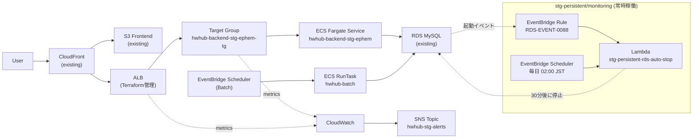

# Housework Hub Infrastructure (hw-hub-infra)

このリポジトリは **HwHub の AWS インフラを Terraform で管理するためのリポジトリ**です。

設計方針の詳細は [terraform_structure_policy.md](./terraform_structure_policy.md) を参照してください。

---

## 概要

STG 環境は用途に応じて **2 つの Terraform モジュール**で管理しています。

| モジュール | パス | 用途 |
|-----------|------|------|
| Ephemeral | `terraform/stg/` | 使うときだけ apply / 使わないときは destroy でコスト最小化 |
| Persistent | `terraform/stg-persistent/monitoring/` | 常時稼働が必要な監視・自動化リソース |

### コスト概算（Ephemeral）

| 状態 | 日次コスト（概算） |
|------|----------------|
| apply（起動中） | ~$5.71/日（大半がNATゲートウェイ） |
| destroy（停止中） | ~$0.09/日（RDS ストレージのみ） |

---

## Architecture



---

## 管理対象

### Ephemeral（`terraform/stg/`）

`terraform apply` / `terraform destroy` で制御されるリソース

| リソース | ファイル |
|---------|---------|
| ALB / ALB Security Group | alb.tf / sg.tf |
| ALB Listeners（HTTP/HTTPS） | alb.tf |
| Target Group | alb.tf |
| Route 53 A Record | alb.tf |
| ECS Cluster | ecs_cluster.tf |
| ECS Backend Task Definition / Service | ecs_task_backend.tf / ecs_service_backend.tf |
| ECS Batch Task Definition | ecs_task_batch.tf |
| EventBridge Scheduler（Batch） | scheduler.tf |
| CloudWatch Log Groups | logs.tf / log_group_batch.tf |
| CloudWatch Alarms | alarm.tf |
| Security Group rules | sg_rules.tf / rds_sg_rules.tf |
| Route table associations | routes.tf |

### Persistent（`terraform/stg-persistent/monitoring/`）

常時稼働させる RDS 自動停止の監視・自動化リソース

| リソース | 説明 |
|---------|------|
| EventBridge Rule | RDS 起動完了イベント（RDS-EVENT-0088）を検知 |
| Lambda（stg-persistent-rds-auto-stop） | RDS 起動を受けて遅延停止スケジュールを作成 / 即時停止を実行 |
| EventBridge Scheduler（daily） | 毎日 02:00 JST に Lambda を呼び出して強制停止 |
| IAM Role（Lambda 実行用） | RDS 停止・Scheduler 作成・ログ書き込み権限 |
| IAM Role（Scheduler 実行用） | Lambda 呼び出し・ワンタイムスケジュール自動削除権限 |
| CloudWatch Log Group | Lambda ログ（14日保持） |

### Terraform が管理していないもの

data source として参照、または既存リソースとして扱うもの

- RDS MySQL
- ACM Certificate（`var.certificate_arn` で参照）
- ECR Repository
- Secrets Manager
- SNS Topic
- S3（Frontend / ファイルストレージ / ナレッジ）
- CloudFront
- VPC / Subnets
- Route 53 Hosted Zone

---

## ディレクトリ構成

```text
terraform/
├── stg/                              # Ephemeral モジュール
│   ├── main.tf
│   ├── providers.tf
│   ├── variables.tf
│   ├── terraform.tfvars
│   ├── outputs.tf
│   ├── nat.tf                        # NAT Gateway + EIP
│   ├── routes.tf                     # Route table associations
│   ├── sg.tf                         # ALB Security Group
│   ├── sg_rules.tf                   # ECS SG rules
│   ├── rds_sg_rules.tf               # RDS inbound rules
│   ├── alb.tf                        # ALB + TG + Listeners + Route53 A record
│   ├── listeners_rule_ephem_assoc.tf # Listener rule
│   ├── ecs_cluster.tf
│   ├── ecs_task_backend.tf
│   ├── ecs_service_backend.tf
│   ├── logs.tf
│   ├── ecs_task_batch.tf
│   ├── log_group_batch.tf
│   ├── scheduler.tf
│   ├── alarm.tf
│   └── sns.tf
│
└── stg-persistent/
    └── monitoring/                   # Persistent モジュール（RDS 自動停止）
        ├── main.tf
        ├── variables.tf
        ├── outputs.tf
        ├── terraform.tfvars
        └── lambda/
            └── rds_auto_stop.py
```

---

## Terraform 操作

### Ephemeral（日常の起動・停止）

```bash
cd terraform/stg

# 初期化（初回のみ）
terraform init

# 差分確認
terraform plan

# 起動
terraform apply

# 停止（コスト削減）
terraform destroy
```

> **注意:** `terraform apply` 時に一時的に CloudWatch Alarm が発報する場合があります。

### Persistent（初回のみ apply）

```bash
cd terraform/stg-persistent/monitoring

terraform init
terraform apply
```

> 常時稼働リソースのため、通常は destroy しません。

---

## 運用方針

### STG 環境の起動・停止

開発・動作確認が終わったら `terraform destroy` で停止してください。

**RDS の自動停止について：**
RDS は `stg-persistent/monitoring/` の Lambda が自動的に管理します。

| トリガー | 動作 |
|---------|------|
| RDS 手動起動後 | 起動完了（RDS-EVENT-0088）を検知し、**30 分後に自動停止** |
| 毎日 02:00 JST | 起動中であれば**強制停止**（すでに停止中の場合はスキップ） |

> **注意:** AWS の仕様により RDS は 7 日後に自動再起動されます。  
> 長期停止する場合、再起動されても 30 分後に自動停止されるため基本的に問題ありませんが、  
> 意図しない起動に気づきたい場合は CloudWatch Alarm での通知設定を検討してください。

### Backend デプロイ

GitHub Actions により以下を実施します。

1. Docker image build
2. ECR push（`stg-${GITHUB_SHA}` + `stg-latest`）
3. ECS Service 更新

Terraform 側では `aws_ecs_service.backend` に `ignore_changes = [task_definition]` を設定しており、  
**task definition の revision 切替は GitHub Actions 側で行います。**

### Batch デプロイ

Batch は `stg-latest` イメージを参照する構成です。

- GitHub Actions: ECR push
- EventBridge Scheduler: 毎時 ECS RunTask で起動
- Terraform: Scheduler / TaskDefinition / Networking / Monitoring 管理

---

## 注意点

- `terraform apply` 時に ALB と Route 53 A レコードが作成されます
- `terraform destroy` 時に ALB・リスナー・TG・Route 53 A レコードが削除されます
- RDS / ACM / ECR / S3 / CloudFront は destroy の影響を受けません
- `stg-persistent/monitoring/` は Ephemeral の destroy とは独立しており、影響を受けません

---

## 今後の拡張候補

- module 化
- PRD 用ディレクトリ分離
- 監視項目追加（CPU / Memory / Scheduler failure アラート）
